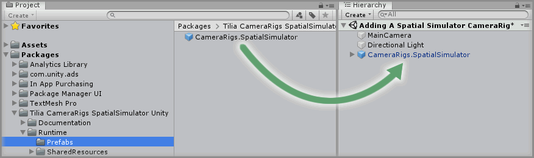
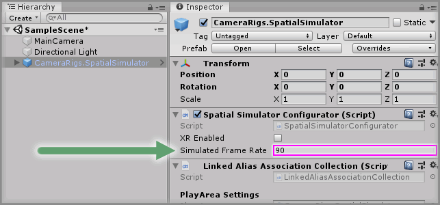
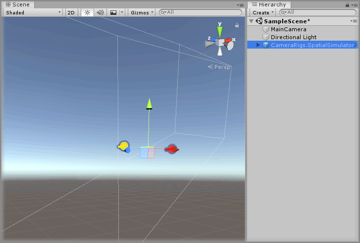

# Adding A Spatial Simulator CameraRig

> * Level: Beginner
>
> * Reading Time: 2 minutes
>
> * Checked with: Unity 2018.3.14f1

## Introduction

The `CameraRigs.SpatialSimulator` prefab provides a simulated camera that mimics the rotation and position of a HMD as well as providing simulated spatial controllers.

## Prerequisites

* [Install the Tilia.CameraRigs.SpatialSimulator.Unity] package dependency in to your [Unity] project.

## Let's Start

### Step 1

Expand the `Tilia CameraRigs SpatialSimulator Unity` package directory in the Unity Project window and select the `Packages -> Tilia CameraRigs SpatialSimulator Unity -> Runtime -> Prefabs` directory then drag and drop the `CameraRigs.SpatialSimulator` prefab into the Unity Hierarchy window.

### Step 2

Delete the `Main Camera` GameObject from the Unity Hierarchy window as the `CameraRigs.SpatialSimulator` prefab contains a Main Camera for the Scene.

### Step 3

Select the `CameraRigs.SpatialSimulator` GameObject in the Unity Hierarchy window and change the `Simulated Frame Rate` property in the `Spatial Simulator Configurator` component to mimic the headset refresh rate of any spatial hardware. By default this is set to `90` which mimics a refresh rate of 90hz.

### Done

Now you have a Spatial Simulator CameraRig in your scene. If you play the Unity scene you will see that the simulated CameraRig can be moved around the scene using the default mappings, which are:

#### Movement

* `W` - Move current object forward.
* `A` - Move current object left.
* `S` - Move current object backward.
* `D` - Move current object right.

#### Rotation

* `Mouse` - Rotate current object up/down/left/right
* `Mouse Scroll Wheel` - Optional circular axis (e.g. mimics rotating finger around a trackpad).

#### Buttons

* `Left Mouse Button` - Can be used as button input.
* `Right Mouse Button` - Can be used as button input.
* `Middle Mouse Button` - Can be used as button input.

#### Control

* `1` - Activate movement/rotation of the simulated PlayArea and deactivate movement/rotation of simulated Controllers.
* `2` - Activate movement/rotation of the simulated Left Controller and deactivate movement/rotation of simulated PlayArea and Right Controller.
* `3` - Activate movement/rotation of the simulated Right Controller and deactivate movement/rotation of simulated PlayArea and Left Controller.
* `4` - Reset the position/rotation of the simulated PlayArea back to the default settings.
* `4` - Reset the position/rotation of the simulated Controllers back to the default settings.
* `6` - Lock/Unlock mouse cursor to Game window.

> The default input settings can be mapped to external inputs such as an Xbox controller by updated the `Sources` on the relevant `Actions` found within `CameraRigs.SpatialSimulator -> Input`.

[Install the Tilia.CameraRigs.SpatialSimulator.Unity]: ../Installation/README.md
[Unity]: https://unity3d.com/